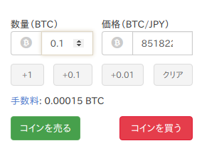
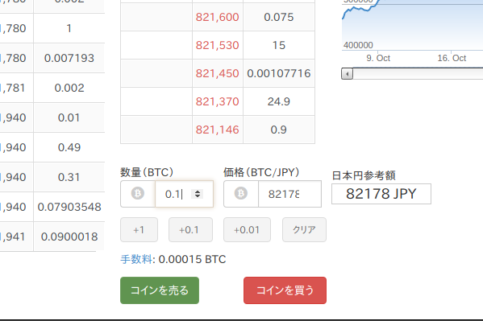
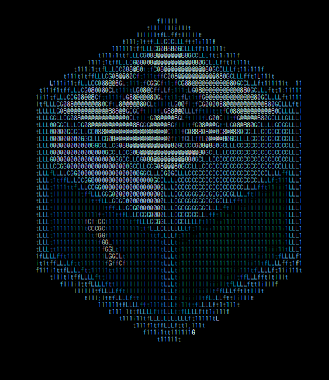
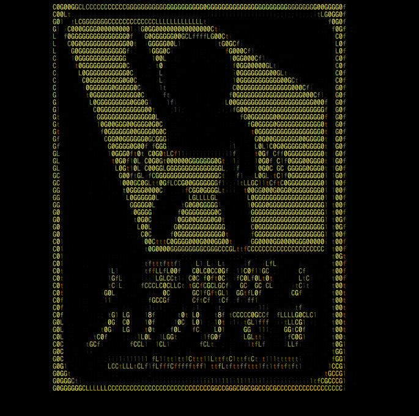

## 11月度報告会
### ITCreate部 部長 
### 古賀友輝 @ahaha0807_alg

---

### 自己紹介

- 古賀友輝（がっちゃん） |
- Twitter @ahaha0807＿alg |
- Webアプリエンジニア（勉強中） |
- JS/Java/Ruby/Scala（勉強中）/Swift（勉強中）  |
- 仮想通貨・IT勉強会・ステッカーPC |


---

### 話すこと

- 先月やる予定だったこと
- 先月やったこと
- 今月やる予定のこと
  
---
### 先月やる予定だったこと

- 就活（就活苦労勢）
- JPHACKS出場
- Ruby on Rails でアプリ作り始める

---

### 先月やったこと - 1

- 先月やったこと
  - 就活（就活苦労勢） 
  
  => **無事に内定をいただきました！！**
  
  - JPHACKS出場 
  
  => 惨敗…
  
  - Ruby on Rails でアプリ作り始める 
  
  => 作り始めた！（進捗3割程度…）

---

### 先月やったこと - 2
  
  - **Chrome拡張**作った
  - ポスターのために **Node.js使って AAジェネレーター作った**
  - 久しぶりにチラシとかのデザインやった
  - **Scala勉強**し始めた

---

### Chrome拡張作ったことについて

+++

### bitFlyer（仮想通貨取引所）の取引画面に、**想定される購入金額が表示されなかったから**作った

+++

### びふぉー



+++

### あふたー



+++

### 使用技術

漢は黙って 

+++

### 良ければ使ってやってください！（宣伝）


---

### AAジェネレーター作ったことについて

+++

### 作ったきっかけ
（ボツ案となったが）このポスターをやるために作った


+++

### 元々は `curl` で叩けるだけだった

```shell
curl itcreate-club.herokuapp.com
```

+++

### それだけだと**寂しい&味気ない**ので、htmlでレスポンス返すように



+++

#### それでも満足せず、画像からAAを作るAPIを見つけてきて画像のURLを与えることで、**AAを書き出してくれるジェネレーター機能**をつけた



+++

### そんな作品をITCブースにて展示中!（宣伝）

#### この後18:00まで、これ以外にも1年生の作品などをいくつか展示しているので良ければ見に来てください！

---

### 今月やること
- Scala(Scalatra)でWebアプリの裏側書く
- Ruby on Rails のWebアプリの進捗を7割を目指す
- 仮想通貨のトレードで頑張ってお昼ごはん代を稼ぐ

---

### まとめ
<ul style="font-size: 30px">
<li>先月やったこと</li>
  <ul>
    <li>就活（就活苦労勢）</li> 
    <li>JPHACKS出場</li>
    <li>Ruby on Rails でアプリ作り始める</li> 
    <li><strong>Chrome拡張</strong>作った</li>
    <li>ポスターのために <strong>Node.js使って AAジェネレーター作った</strong></li>
    <li>久しぶりにチラシとかのデザインやった</li>
    <li><strong>Scala勉強</strong>し始めた</li>
  </ul>
<li>今月やる予定のこと</li>
  <ul>
    <li>Scala(Scalatra)でWebアプリの裏側書く</li>
    <li>Ruby on Rails のWebアプリの進捗を7割を目指す</li>
    <li>仮想通貨のトレードで頑張ってお昼ごはん代を稼ぐ</li>
  <ul>
</ul>
