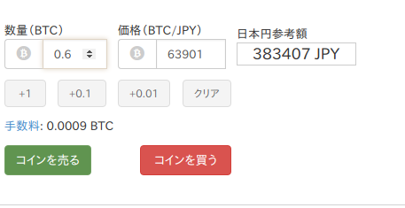

## 11月度報告会
### ITCreate部 部長 
### 古賀友輝 @ahaha0807_alg

---

### 自己紹介

- 古賀友輝（がっちゃん） |
- Twitter @ahaha0807＿alg |
- Webアプリエンジニア（勉強中） |
- JS/Java/Ruby/Scala（勉強中）/Swift（勉強中）  |
- 仮想通貨・IT勉強会・ステッカーPC |

---

### 話すこと

- 先月やる予定だったこと
- 先月やったこと
- 今月やる予定のこと
  
---
### 先月やる予定だったこと

- 就活（就活苦労勢）
- JPHACKS出場
- Ruby on Rails でアプリ作り始める

---

### 先月やったこと - 1

- 先月やったこと
  - 就活（就活苦労勢） 
  
  => **無事に内定をいただきました！！**
  
  - JPHACKS出場 
  
  => 惨敗…
  
  - Ruby on Rails でアプリ作り始める 
  
  => 作り始めた！（進捗3割程度…）

---

### 先月やったこと - 2
  
  - **Chrome拡張**作った
  - ポスターのために **Node.js使って AAジェネレーター作った**
  - 久しぶりにチラシとかのデザインやった
  - **Scala勉強**し始めた

---

### Chrome拡張作ったことについて

+++

### bitFlyer（仮想通貨取引所）の取引画面に、**想定される購入金額が表示されなかったから**作った

+++

### びふぉー

+++

### あふたー

+++

### 使用技術

漢は黙って 

+++

### 良ければ使ってやってください！
（最後にももう一度表示します！）

---
